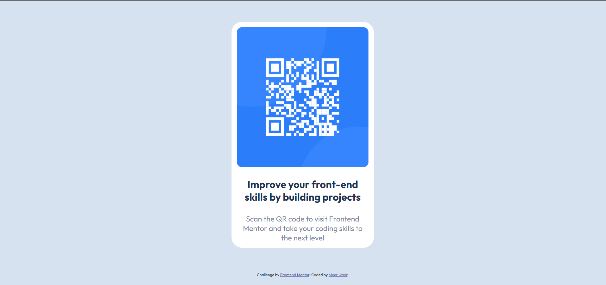

# Frontend Mentor - QR code component solution

This is a solution to the [QR code component challenge on Frontend Mentor](https://www.frontendmentor.io/challenges/qr-code-component-iux_sIO_H). Frontend Mentor challenges help you improve your coding skills by building realistic projects. 

## Table of contents

  - [Screenshot](#screenshot)
  - [Links](#links)
  - [Built with](#built-with)
  - [Author](#author)
  - [Acknowledgments](#acknowledgments)

### Screenshot

### Links

- Solution URL: (https://github.com/MeerUzairWasHere/QR-code-component) 
- Live Site URL: https://qr-code-component-by-meer-uzair.netlify.app/

### Built with

- Semantic HTML5 markup
- CSS custom properties
- Flexbox
- laptop-first workflow

### Author

- Frontend Mentor - [@MeerUzairWasHere](https://www.frontendmentor.io/profile/MeerUzairWasHere)
- Twitter - [@MirUzairWasHere](https://www.twitter.com/MirUzairWasHere)

### Acknowledgments

This is where you can give a hat tip to anyone who helped you out on this project. Perhaps you worked in a team or got some inspiration from someone else's solution. This is the perfect place to give them some credit.

